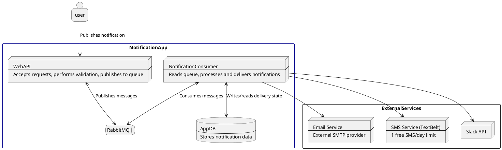

# Notification System App – C4 Diagram

The Notification System App is designed to accept notification publishing requests and distribute them to Email, SMS, and Slack channels. It handles validation, queuing via RabbitMQ, and processing through worker consumer/s. Below is a **Container Level View** of the system.

## Container

## Notes:
TextBelt allows only 1 free SMS/day per IP – used in the current implementation. 
Twilio implementation exists but is not currently used and properly developed.